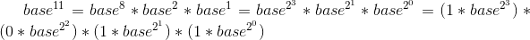

## 剑指Offer12：数值的整数次方
给定一个double类型的浮点数base和int类型的整数exponent。求base的exponent次方。  
  
思路：  
1. 直接方法：直接连续累乘。  
2. 快速幂运算。  
分析：直接累乘的方法固然很简单，但是往往会造成多次相乘运算，这样反而不好。那么怎么才能减少乘法的次数，还能达到正确的计算结果呢。这就是要利用一个技巧，就是说对于一个很大的偶数指数，我们不需要乘以2a次基数，只需要以2的指数形式依次相乘直到2a次方即可。例如 ：exponent = 11,则 我们的计算过程是  
  
仔细观看上面公式发现：  

我们可以通过在循环里通过自乘运算依次实现，而这些指数前面的系数刚好就是题目中指数对应的每一位二进制数。exponent = 11 = 1011(二进制)。  

所以，我们可以这样实现这个快速幂运算。  

step1：首先需要知道在每次循环里通过自乘计算base的2的指数次方。循环的次数就是所求指数exponent的二进制位数  

step2:   其次就是对于每个base的2的指数次方，乘以其相对应的二进制位上的数。  

step3:   循环里不断的累成step2里计算的结果。  
```
function Power(base, exponent)
{
    let result = 1;
    let e = Math.abs(exponent);
//直接连续累乘
//    while(e>0){
//        result*=base;
//        e--;
//    }
//快速幂运算+位运算
    while(e){
        if(e&1) result*=base;
        e>>=1;
        base*=base;
    }
    return exponent>0?result:(1/result);
}
```