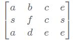

## 剑指Offer65：矩阵中的路径
#### 题目描述
请设计一个函数，用来判断在一个矩阵中是否存在一条包含某字符串所有字符的路径。路径可以从矩阵中的任意一个格子开始，每一步可以在矩阵中向左，向右，向上，向下移动一个格子。如果一条路径经过了矩阵中的某一个格子，则该路径不能再进入该格子。 例如 a b c e s f c s a d e e 3x4矩阵中包含一条字符串"bcced"的路径，但是矩阵中不包含"abcb"路径，因为字符串的第一个字符b占据了矩阵中的第一行第二个格子之后，路径不能再次进入该格子。  
矩阵图：  
#### 思路
首先第一步，找到合适起点，第二步递归找下一个符合path的元素，递归结束条件为已经找到的符合当前路径的元素个数等于指定path长度。  
1. 找起点时遍历matrix的所有元素。  
2. 递归的时候上下左右的元素都不符合现路径中匹配path的原则的话，那么回溯到上一个找到的位置（例如path：abcdb，我找到了a的左边是b，但是a的上下和右边都没有找，碰巧a左边的这个b的上下左右都不是c，那么我们回溯回原来的a，留机会给a上下右边可能出现的b），在下面代码中具体回溯的方法就是把这个b的visited=true去掉，因为这个b并没有被我们收入到我们查找的path中，擦去访问痕迹以便后面的元素找下一个元素时可以利用到这个b元素。  
[思路参考](https://cuijiahua.com/blog/2018/02/basis_65.html)  
```
function hasPath(matrix, rows, cols, path)
{
    const vistied = new Array(rows*cols);
    //在matrix的元素中挨个找起点
    for(let row=0;row<rows;row++){
        for(let col=0;col<cols;col++){
            if(hasPathCore(matrix,rows,cols,row,col,path,0,vistied)){
                return true;
            }
        }
    }
    //找不到符合条件的起点
    return false;
}
/**
  *@param row 当前行下标
  *@param col 当前列下标
  *@param pathLength 当前路径中已找到的符合path的有多少个元素
  *@param visited 标记matrix中已经访问过的元素
**/
function hasPathCore(matrix,rows,cols,row,col,path,pathLength,vistied){
    //递归结束条件
    if(pathLength===path.length){return true;}
    let hasPath = false;
    if(
       row>=0 &&
       row<rows &&
       col>=0 &&
       col<cols &&
       !vistied[row*cols+col] &&
       matrix[row*cols+col] === path[pathLength]
    ){
        ++pathLength;
        vistied[row*cols+col] = true;
		// 因为||为短路运算符，只要第一个满足就会返回，而不会去计算后面的，所以有些路径可以不用去走。
        hasPath = hasPathCore(matrix,rows,cols,row-1,col,path,pathLength,vistied) ||
                  hasPathCore(matrix,rows,cols,row,col-1,path,pathLength,vistied) ||
                  hasPathCore(matrix,rows,cols,row+1,col,path,pathLength,vistied) ||
                  hasPathCore(matrix,rows,cols,row,col+1,path,pathLength,vistied);
        if(!hasPath){
            //--pathLength;
            vistied[row*cols+col] = false;
        }
    }
    return hasPath;
}
```
